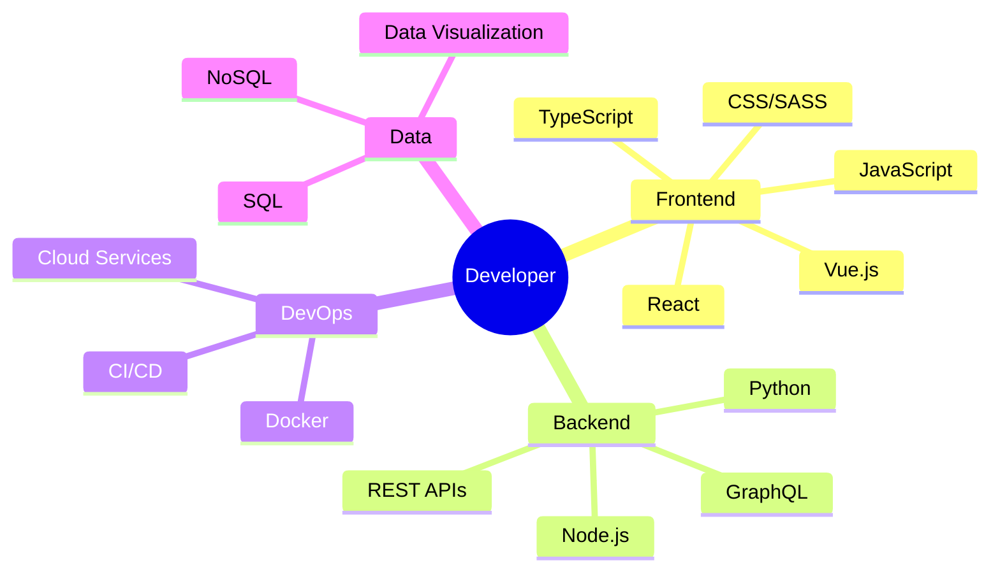

# <div align="center">👾 Welcome to My Digital Garden 👾</div>

<div align="center">
  
</div>

<div align="center">
  <picture>
    <source media="(prefers-color-scheme: dark)" srcset="https://api.visitorbadge.io/api/visitors?path=https%3A%2F%2Fgithub.com%2Fyourusername&label=VISITORS&labelColor=%23222222&countColor=%2337d67a" />
    <source media="(prefers-color-scheme: light)" srcset="https://api.visitorbadge.io/api/visitors?path=https%3A%2F%2Fgithub.com%2Fyourusername&labelColor=%23d9e3f0&countColor=%23697689" />
    
  </picture>
</div>

## 📡 Signal Status

```text
🌱 Currently learning: Rust & WebAssembly
🔭 Building: A decentralized knowledge-sharing platform
🧠 Exploring: Machine Learning applications in everyday tools
🤝 Open to: Collaboration on projects with social impact
📫 Transmission: youremail@example.com
```

##  Developer Codex

<div align="center">
  <table>
    <tr>
      <td>
        <a href="https://github.com/yourusername?tab=repositories&q=&type=&language=javascript">
          
        </a>
      </td>
      <td>
        <a href="https://github.com/yourusername?tab=repositories&q=&type=&language=typescript">
          
        </a>
      </td>
      <td>
        <a href="https://github.com/yourusername?tab=repositories&q=&type=&language=react">
          
        </a>
      </td>
      <td>
        <a href="https://github.com/yourusername?tab=repositories&q=&type=&language=nodejs">
          
        </a>
      </td>
      <td>
        <a href="https://github.com/yourusername?tab=repositories&q=&type=&language=python">
          
        </a>
      </td>
    </tr>
  </table>
</div>

##  Project Universe

<div align="center">
  <a href="https://github.com/yourusername/project1">
    
  </a>
  <a href="https://github.com/yourusername/project2">
    
  </a>
</div>

## 🌌 Cosmic Activity

<div align="center">
  
  
</div>

<div align="center">
  
</div>

##  Connect Through Subspace

<div align="center">
  <a href="https://twitter.com/yourusername">
    
  </a>
  <a href="https://linkedin.com/in/yourusername">
    
  </a>
  <a href="https://dev.to/yourusername">
    
  </a>
  <a href="https://yourusername.medium.com">
    
  </a>
</div>

## 🎵 Current Coding Soundtrack

<div align="center">
  
</div>

##  A Slice of My Knowledge Matrix



## 🧰 Daily Toolkit

<div align="center">
  
</div>

## 🌱 My Contribution Garden

<div align="center">
  
</div>

<div align="center">
  
</div>
